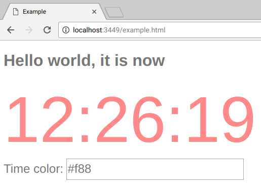

## Initial Code Walk-through

At this point, you are about 50% of the way to understanding re-frame.  You should already have:
 - an overview of the 6 domino process [from this repo's README](../README.md)
 - an understanding of app state ([from the previous tutorial](ApplicationState.md))

In this tutorial, **we plunge into re-frame code**. By the end of it, you'll be at 70% knowledge, and ready to start coding an app.

## What Code?

This repo contains an `/examples` application called ["simple"](https://github.com/day8/re-frame/tree/master/examples/simple),
which contains 70 lines of code. In this tutorial, we'll look at every line of [the file](https://github.com/day8/re-frame/blob/master/examples/simple/src/simple/core.cljs).

This app:
 - displays the current time in a nice big, colourful font
 - provides a single text input field, into which you can type a hex colour code, 
   like "#CCC" or "blue", which is what's then used for the time display
      
When it is running, here's what the app looks like:



## Running This App Yourself (And Experimenting)

There are two ways to run this app for yourself:
  1. compile and run it on your own computer
  2. run it via an online interactive tutorial 
 
 ### 1. On Your Machine

To run the code yourself (recomended), you'll need to first [install Clojure](https://purelyfunctional.tv/guide/how-to-install-clojure/)

Then:
  1. `git clone https://github.com/day8/re-frame.git`
  2. `cd re-frame/examples/simple`
  3. `lein do clean, shadow watch client`
  4. Run "`lein do clean, shadow watch client`"  to compile the app and start up shadow-cljs hot-reloading
  5. Wait for the compile to finish. At a minumum, 15 seconds. But, if you are new to ClojureScript and some downloads are needed (caches are empty), it might take a minute or two. Eventually you should see `[:client] Build Completed (...)`
  6. Open `http://localhost:8280/example.html` to see the app
  
So, what's just happened?  

The ClojureScript code under `/src` has been compiled into `javascript` and
put into `/resources/public/js/client.js` which is loaded into `/resources/public/example.html` (the HTML file you just opened in the browser)
 
Shadow-cljs (the compiler) provides for hot-reloading, which means you can edit the source code and immediately see the change in the browser. To test this, I'd suggest that you edit `./src/simple/core.cljs`, search for the string `"Hello world, it is now"`, change it to something else, save the file, then watch your change show up in the browser in near-realtime. 

### 2. Via The Online Interactive Version 

An online, interactive version of this tutorial is [available here](http://blog.klipse.tech/clojure/2019/02/17/reframe-tutorial.html). 

> Note: it is powered by [the mighty Klipse](https://github.com/viebel/klipse) which loads a ClojureScript compiler into the browser, which can sometimes take as long as 60 seconds to initialise fully. So, give it sufficient time. (And, in the unlikely event of problems, try disabling your adblocker) 

Onwards ...

## Namespace

Because this example is tiny, the source code is in a single namespace:
https://github.com/day8/re-frame/blob/master/examples/simple/src/simple/core.cljs

Within this namespace, we'll need access to both `reagent` and `re-frame`. 
So, at the top, we start like this: 
```clj
(ns simple.core
  (:require [reagent.core :as reagent]
            [re-frame.core :as rf]))
```

## Data Schema

Now, normally, I'd strongly recommended that you write a quality schema
for your application state (the data stored in `app-db`). But,
here, to minimise cognitive load, we'll cut that corner.

But ... we can't cut it completely. You'll still need an
informal description, and here it is ... for this app `app-db` will contain
a two-key map like this:
```clj
{:time       (js/Date.)  ;; current time for display
 :time-color "#f88"}     ;; the colour in which the time should be shown
```

re-frame itself owns/manages `app-db` (see [FAQ #1](FAQs/Inspecting-app-db.md)), and it will
supply the value within it (the two-key map described above) 
to your various handlers as required.

## Events (domino 1)

Events are data.

re-frame uses a vector
format for events. For example:
```clj
[:delete-item 42]
```

The first element in the vector is a keyword which identifies the `kind` of `event`. The
further elements are optional, and can provide additional data 
associated with the event. The additional value above, `42`, is 
presumably the id of the item to delete.

Here are some other example events:
```clj
[:admit-to-being-satoshi false]
[:dressing/put-pants-on  "velour flares" {:method :left-leg-first :belt false}]
```

(For non-trivial applications, the `kind` keyword will be namespaced.)

**Rule**:  events are pure data. No sneaky tricks like putting
callback functions on the wire. You know who you are.

### dispatch

To send an event, call `dispatch` with the event vector as argument: 
```clj
   (rf/dispatch [:event-id  value1 value2])
```

In this "simple" app, a `:timer` event is dispatched every second:
```clj
(defn dispatch-timer-event
  []
  (let [now (js/Date.)]
    (rf/dispatch [:timer now])))  ;; <-- dispatch used

;; call the dispatching function every second
(defonce do-timer (js/setInterval dispatch-timer-event 1000))
```
This is an unusual source of events. Normally, it is an app's UI widgets which 
`dispatch` events (in response to user actions), or an HTTP POST's 
`on-success` handler, or a websocket which gets a new packet.

### After dispatch 

`dispatch` puts an event into a queue for processing.

So, **an event is not processed synchronously, like a function call**. The processing
happens **later** - asynchronously. Very soon, but not now.

The consumer of the queue is the re-frame `router` which looks after the event's processing.

The `router`:

1. inspects the 1st element of an event vector
2. looks for the event handler (a function) which is **registered**
   for this kind of event
3. calls that event handler (function) with the necessary arguments

As a re-frame app developer, your job, then, is to write and register an
event handler (function) for each kind of event, including this `:timer` event. 

## Event Handlers (domino 2)

Collectively, event handlers provide the control logic in a re-frame application.

In this application, three kinds of event are dispatched: 
  - `:initialize`
  - `:time-color-change`
  - `:timer`    (this one we saw above)
  
3 events means we'll be registering 3 event handlers.

### Registering Event Handlers

Event handler functions:
  - take two arguments `coeffects` and `event`
  - return `effects`

Conceptually, you can think of the argument `coeffects` as being "the current state of the world". 
And you can think of event handlers as computing how the world should be changed 
by the arriving event. They return (as data) how the world should be changed by the event - `the side effects` of the event.

Event handlers can be registered in two ways:
  - `reg-event-fx`
  - `reg-event-db`  
  
 One ends in `-fx` and the other in `-db`.

  - `reg-event-fx` can take multiple `coeffects` and can return multiple `effects`, whereas ... 
  - `reg-event-db` allows you to write simpler handlers for the common case where you want 
  them to take only one `coeffect` - the current app state - and return one `effect` - the 
  updated app state.

Because of its simplicity, we'll be using the latter one here: `reg-event-db`.

### reg-event-db

We register event handlers using re-frame's `reg-event-db`:

```clj
(rf/reg-event-db
  :the-event-id
  the-event-handler-fn)
```
The handler function you provide should expect two arguments:
   - `db`, the current application state  (the map value contained in `app-db`)
   - `ev`,  the event vector  (what was given to `dispatch`)
    
So, your function will have a signature like this: `(fn [db ev] ...)`.

These event handlers must compute and return the new state of
the application, which means it returns a
modified version of `db` (or an unmodified one, if there are to be no changes to the state).

### :initialize

On startup, application state must be initialized. We
want to put a sensible value into `app-db`, which starts out containing `{}`.

So, as well soon see, a `(dispatch [:initialize])` will happen early in the 
app's life (more on this below), and we need to write an `event handler`
for it. 

Now this event handler is slightly unusual because not only does it not care about
any event information passed in via the `event` vector, but it doesn't 
even care about the existing value in `db` - it just wants to plonk 
a completely new value into `app-db`:

```clj
(rf/reg-event-db              ;; sets up initial application state
  :initialize
  (fn [_ _]                   ;; the two parameters are not important here, so use _
    {:time (js/Date.)         ;; What it returns becomes the new application state
     :time-color "#f88"}))    ;; so the application state will initially be a map with two keys
```

This particular handler `fn` ignores the two parameters
(usually called `db` and `v`) and simply returns 
a map literal, which becomes the application 
state.

For comparison, here's how we would have written this if we'd cared about the existing value of `db`: 
```clj
(rf/reg-event-db
  :initialize
  (fn [db _]                 ;; we use db this time, so name it
    (-> db                   ;; db is initially just {}
      (assoc :time (js/Date.))
      (assoc :time-color "#f88")))
```


### :timer

Earlier, we set up a timer function to `(dispatch [:timer now])` every second.

Here's how we handle it: 
```clj
(rf/reg-event-db                 ;; usage:  (rf/dispatch [:timer a-js-Date])
  :timer
  (fn [db [_ new-time]]          ;; <-- boitce how we de-structure the event vector
    (assoc db :time new-time)))  ;; compute and return the new application state
```

Notes:
  1. the `event` will be like `[:timer a-time]`, so the 2nd `v` parameter 
     destructures to extract the `a-time` value
  2. the handler computes a new application state from `db`, and returns it
  3. background on [Clojure destructuring](https://clojure.org/guides/destructuring)

### :time-color-change

When the user enters a new colour value (via the input text box):
```clj
(rf/reg-event-db
  :time-color-change            ;; usage:  (rf/dispatch [:time-color-change 34562])
  (fn [db [_ new-color-value]]
    (assoc db :time-color new-color-value)))   ;; compute and return the new application state
```
  
## Effect Handlers (domino 3)

Domino 3 actions the `effects` returned by event handlers.

In this "simple" application, our event handlers are implicitly returning 
only one effect: "update application state". 

This particular `effect` is accomplished by a re-frame-supplied 
`effect` handler. **So, there's nothing for us to do for this domino**. We are 
using a standard re-frame effect handler.

And this is not unusual. You'll seldom have to write `effect` handlers, but in a later
tutorial we'll show you more about how to do so when you need to.

## Subscription Handlers (domino 4)

Subscription handlers, or `query` functions, take application state as an argument 
and run a query over it, returning something called
a "materialised view" of that application state.

When the application state changes, subscription functions are 
re-run by re-frame, to compute new values (new materialised views).

Ultimately, the data returned by these `query` functions is used
in the `view` functions (Domino 5).
 
One subscription can 
source data from other subscriptions. So it is possible to 
create a tree of dependencies.
 
The Views (Domino 5) are the leaves of this tree.  The tree's 
root is `app-db` and the intermediate nodes between the two 
are computations being performed by the query functions of Domino 4.

Now, the two examples below are trivial. They just extract part of the application
state and return it. So, there's virtually no computation - the materialised view they 
produce is the same as that stored in `app-db`. A more interesting tree
of subscriptions, and more explanation, can be found in the todomvc example.

### reg-sub 

`reg-sub` associates a `query id` with a function that computes
 that query, like this:
```clj
(rf/reg-sub
  :some-query-id  ;; query id (used later in subscribe)
  a-query-fn)     ;; the function which will compute the query
```
Later, a view function (domino 5) will subscribe to a query like this:
`(subscribe [:some-query-id])`, and `a-query-fn` will be used 
to perform the query over the application state.

Each time application state changes, `a-query-fn` will be
called again to compute a new materialised view (a new computation over `app-db`)
and that new value will be given to all `view` functions which are subscribed
to `:some-query-id`. These `view` functions will then be called to compute the 
new DOM state (because the views depend on query results which have changed).

Along this reactive chain of dependencies, re-frame will ensure the 
necessary calls are made, at the right time.

Here's the code:
```clj
(rf/reg-sub
  :time
  (fn [db _]     ;; db is current app state. 2nd unused param is query vector
    (:time db))) ;; return a query computation over the application state

(rf/reg-sub
  :time-color
  (fn [db _]
    (:time-color db)))
```

Like I said, both of these queries are trivial. 
The sibling example, todomvc, contains [more advanced subscriptions](https://github.com/day8/re-frame/blob/master/examples/todomvc/src/todomvc/subs.cljs). 

## View Functions (domino 5)

`view` functions turn data into DOM.  They are "State in, Hiccup out" and they are Reagent 
components. 

An SPA will have lots of `view` functions, and collectively, 
they render the app's entire UI.
 
### Hiccup 

`Hiccup` is a data format for representing HTML.

Here's a trivial view function which returns hiccup-formatted data:
```clj
(defn greet
  []
  [:div "Hello viewers"])  ;; means <div>Hello viewers</div>
```

And if we call it:
```clj
(greet)
;; ==>  [:div "Hello viewers"]

(first (greet))
;; ==> :div
```

Yep, that's a vector with two elements: a keyword and a string.

Now, `greet` is pretty simple because it only has the "Hiccup Out" part.  There's no "Data In".

### Subscribing

To render the DOM representation of some part of the app state, view functions must query 
for that part of `app-db`, and that means using `subscribe`.

`subscribe` is always called like this:
```clj
   (rf/subscribe  [query-id some optional query parameters])
```
There's only one (global) `subscribe` function and it takes one argument, assumed to be a vector.

The first element in the vector (shown above as `query-id`) identifies the query, 
and the other elements are optional
query parameters. With a traditional database a query might be:
```
select * from customers where name="blah"
```

In re-frame, that would be done as follows:
   `(subscribe  [:customer-query "blah"])`,
which would return a `ratom` holding the customer state (a value which might change over time!).

> Because subscriptions return a ratom, they must always be dereferenced to 
obtain the value. This is a recurring trap for newbies.

### The View Functions 

This view function renders the clock:
```clj
(defn clock
  []
  [:div.example-clock
   {:style {:color @(rf/subscribe [:time-color])}}
   (-> @(rf/subscribe [:time])
       .toTimeString
       (clojure.string/split " ")
       first)])
```
As you can see, it uses `subscribe` twice to obtain two pieces of data from `app-db`. 
If either change, reagent will re-run this view function.

And this view function renders the input field:
```clj
(defn color-input
  []
  [:div.color-input
   "Time color: "
   [:input {:type "text"
            :value @(rf/subscribe [:time-color])        ;; subscribe
            :on-change #(rf/dispatch [:time-color-change (-> % .-target .-value)])}]])  ;; <---
```

Notice how it does BOTH a `subscribe` to obtain the current value AND 
a `dispatch` to say when it has changed. 

It is very common for view functions to render event-dispatching functions into the DOM.
The user's interaction with the UI is usually a large source of events.

Notice also how we use `@` in front of `subscribe` to obtain the value out of the subscription. It is almost as if the subscription is an atom holding a value (which can change over time). 

And then there's a `view` function to arranges the other view functions, but which contains no 
subscriptions or dispatching of its own:
```clj
(defn ui
  []
  [:div
   [:h1 "Hello world, it is now"]
   [clock]
   [color-input]])
```

Note: `view` functions tend to be organized into a hierarchy, often with 
data flowing from parent to child via
parameters. So, not every view function needs a subscription. Very often 
the values passed in from a parent component are sufficient.

Note: `view` functions should never directly access `app-db`. Data is 
only ever sourced via subscriptions (which are dereferenced via `@`).

### Components Like Templates?

`view` functions are like the templates you'd find in
Django, Rails, Handlebars or Mustache -- they map data to HTML -- except for two massive differences:

  1. you have the full power of ClojureScript available to you. The
     downside is that these are not "designer friendly" HTML templates.
  2. You are computing a clojure data structure. Hiccup is just clojure data formatted in a certain way.
  2. these templates are reactive.  When their input Signals change, they
     are automatically rerun, producing new DOM. Reagent adroitly shields you from the details, but
     the renderer of any `component` is wrapped by a `reaction`.  If any of the "inputs"
     to that renderer change, the renderer is rerun.

## Kick Starting The App

Below, `run` is called to kick off the application once the HTML page has loaded.

It has two tasks:
  1. Load the initial application state
  2. Load the GUI by "mounting" the root-level function in the hierarchy 
  of `view` functions -- in our case, `ui` --
  onto an existing DOM element. 

```clj
(defn ^:export run
  []
  (rf/dispatch-sync [:initialize])     ;; puts a value into application state
  (reagent/render [ui]              ;; mount the application's ui into '<div id="app" />'
                  (js/document.getElementById "app")))
```

After `run` is called, the app passively waits for `events`. 
Nothing happens without an `event`.

When it comes to establishing initial application state, you'll 
notice the use of `dispatch-sync`, rather than `dispatch`. This is a simplifying cheat 
which ensures that a correct
structure exists in `app-db` before any subscriptions or event handlers run. 

## Summary

**Your job**, when building an app, is to: 
 - design your app's information model (data and schema layer)
 - write and register event handler functions  (control and transition layer)  (domino 2)
 - (once in a blue moon) write and register effect and coeffect handler 
   functions (domino 3) which do the mutative dirty work of which we dare not 
   speak in a pure, immutable functional context. Most of the time, you'll be 
   using standard, supplied ones.
 - write and register query functions which implement nodes in a signal graph (query layer) (domino 4)
 - write Reagent view functions  (view layer)  (domino 5)

## Next Steps

You should now take time to carefully review the 
[todomvc example application](https://github.com/day8/re-frame/tree/master/examples/todomvc).
On the one hand, it contains a lot of very helpful practical advice. On the other, it does
use some more advanced features like `interceptors` which are covered later in the docs.   

After that, you'll be ready to write your own code.  Perhaps you will use a
template to create your own project: <br>
Client only:  https://github.com/day8/re-frame-template  <br>
Full Stack: http://www.luminusweb.net/

Obviously, you should also go on to read the further documentation.

*** 

Previous:  [app-db (Application State)](ApplicationState.md)&nbsp;&nbsp;&nbsp;&nbsp;&nbsp;&nbsp;
Up:  [Index](README.md)&nbsp;&nbsp;&nbsp;&nbsp;&nbsp;&nbsp;
Next: [Infographic: A re-frame Epoch](AnEpoch.md)


<!-- START doctoc generated TOC please keep comment here to allow auto update -->
<!-- DON'T EDIT THIS SECTION, INSTEAD RE-RUN doctoc TO UPDATE -->
<!-- END doctoc generated TOC please keep comment here to allow auto update -->
