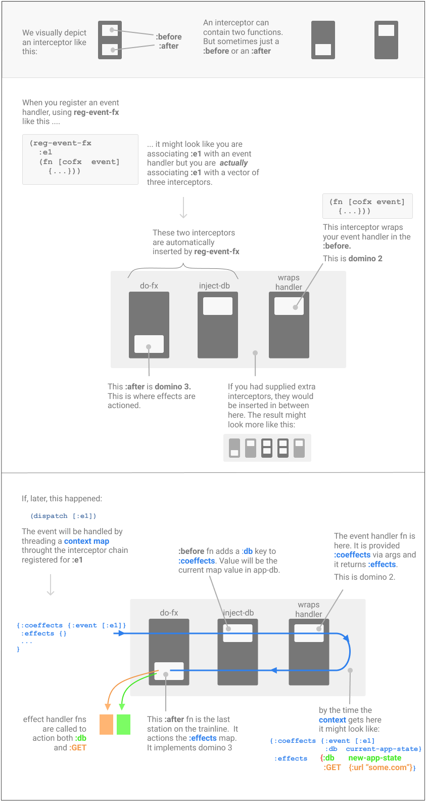

This tutorial explains re-frame `Interceptors`. Until now, they have been a hidden detail
but, as we are about to find out, they are both important and useful. 

## Why Interceptors?

There's two reasons.

1. We want __simple event handlers__.

   Interceptors allow us nicely to look after "cross-cutting" concerns like undo, tracing 
   and validation.  They help us to factor out commonality, hide complexity and introduce further steps into the "Derived Data, Flowing" story promoted by re-frame.

   So, you'll want to use Interceptors because they solve problems, and help you to write nice code.

2. Under the covers, Interceptors provide **the** mechanism underneath Domino 2 (event handling) 
   and Domino 3 (effect handling). They are a central concept and understanding them better will serve you well, even if you don't need to directly use them very often. 

## What Do Interceptors Do?

They wrap.

Specifically, they wrap event handlers.

Imagine your event handler is like a piece of ham. An interceptor would be
like bread on either side of your ham, which makes a sandwich.

And two Interceptors, in a chain, would be like you put another
pair of bread slices around the outside of the existing sandwich to make
a sandwich of the sandwich. Now it is a very thick sandwich.

Interceptors wrap on both sides of an event handler, layer after layer.

## Wait, I know That Pattern!

Interceptors implement `middleware`, but differently.

Traditional `middleware` - often seen in web servers - creates a data
processing pipeline (to process arriving HTTP requests) via the nested composition of higher order functions.
The result is a "stack" of functions. Data representing a request flows through this pipeline,
first forwards from one end to the other, and then backwards (as the response).

Interceptors achieve the same outcome by assembling functions, as data,
in a collection - a chain of interceptors, rather than a stack of middleware. 
Data can then be iteratively
pipelined, first forwards through the functions in the chain,
and then backwards along the same chain.

Because the interceptor pipeline is composed via a collection (data!), rather than
higher order functions, it is a more flexible arrangement.

## What's In The Pipeline?

Data. It flows through the pipeline being progressively transformed.

Fine. But what data?

With a web server, the middleware "stack" progressively
transforms an `HTTP request` in one direction, and, then in the backwards
sweep, it progressively produces a `response`.

In re-frame, the forward sweep progressively creates `coeffects`
(inputs to the event handler that you write), while the backwards sweep processes the `effects`
(outputs from the event handler you write).

I'll pause while you read that sentence again. That's the key
concept, right there.

## Show Me

At the time when you register an event handler, you can provide a chain of interceptors too.

Using a 3-arity registration function:
```clj
(reg-event-db
   :some-id
   [in1 in2]       ;; <-- a chain of 2 interceptors (a vector of 2 interceptors)
   (fn [db v]      ;; <-- the handler here, as before
      ....)))
```

!!! note ""
    Each Event Handler can have its own tailored interceptor chain, provided at registration-time.

## Handlers Are Interceptors Too

You could see that registration above as associating `:some-id` with
two things:

1. a chain of 2 interceptors `[in1 in2]`
2. an `event handler`.

Except, the `event handler` is turned into an interceptor too (we'll see how shortly).

So, ***actually***, `:some-id` is only associated with one thing: a 3-chain of interceptors,
with the `event handler` wrapped in an interceptor, called say `ih`, and put on the
end of the other two, forming a vector of three interceptors: `[in1 in2 ih]`.

But wait, there's more. The registration function itself, `reg-event-db`, actually takes this 3-chain
and inserts its own standard interceptors, called say `std1` and `std2`
(which do useful things, again more soon) at the front,
so **ACTUALLY**, there's about 5 interceptors in the chain: `[std1 std2 in1 in2 ih]`

So, ultimately, that event registration associates the event id `:some-id`
with __just__ a chain of interceptors. Nothing more.

Later, when a `(dispatch [:some-id ...])` happens, that 5-chain of
interceptors will be "executed".  And that's how an event gets handled.


## The Links Of The Chain

Each interceptor has this form:
```clj
{:id      :something             ;; decorative only - can be ignored
 :before  (fn [context] ...)     ;; returns a possibly modified `context`
 :after   (fn [context] ...)}    ;; returns a possibly modified `context`
```

That's essentially a map of two functions. Now imagine a vector of these maps - that's an interceptor chain.

Above we imagined an interceptor chain of `[std1 std2 in1 in2 ih]`. Now we know that this is really
a vector of 5 maps: `[{...} {...} {...} {...} {...}]`  where each of the 5 maps have
a `:before` and `:after` fn.

Sometimes, the `:before` and `:after` functions are noops - they take a `context` and return that `context` unchanged - think `identity`.

To "execute" an interceptor chain:

  1. create a `context` (which is a `map` with a certain structure, described below)
  2. iterate forwards over the chain, calling the `:before` function on each interceptor, threading `context` through each call. 
  3. iterate over the chain in the opposite (backwards) direction calling the `:after` function on each interceptor and threading `context` through all the calls

Remember that the last interceptor in the chain is the `event handler` itself (wrapped up to be the `:before`).

That's it. That's how an event gets handled. This is how Dominoes 2 and 3 happen. 


## What Is Context?

Some data called a `context` is threaded through all the calls.

This value is passed as the argument to every `:before` and `:after`
function and it is returned by each function, possibly modified.

A `context` is a map with this structure:
```clj
{:coeffects {:event [:some-id :some-param]
             :db    <original contents of app-db>}

 :effects   {:db    <new value for app-db>
             :dispatch  [:an-event-id :param1]}

 :queue     <a collection of further interceptors>
 :stack     <a collection of interceptors already walked>}
```

`context` has a `:coeffects` key and an `:effects` key which, if this was a web
server, would be somewhat analogous to `request` and `response`
respectively.

`:coeffects` will contain the inputs required by the event handler
(sitting presumably on the end of the chain). So that's
data like the `:event` being processed, and the initial state of `db`.

The handler-returned side effects are put into `:effects` including,
but not limited to, a new value for `app-db`.

The first few interceptors in a chain (the ones inserted by `reg-event-db`)
have `:before` functions which __prime__ the `:coeffects`
by adding in `:event`, and `:db`.  Of course, other interceptors can
add further to `:coeffects`.  Perhaps the event handler needs
data from localstore, or a random number, or a
DataScript connection. Interceptors can accumulate interesting information into 
`:coeffects`, via their `:before` function.

Equally, some interceptors in the chain will have an `:after` function
which processes the side effects accumulated into `:effects`
including, but not limited to, updates to `app-db`.

## Threading the Context

Above, we imagined an interceptor chain like: `[std1 std2 in1 in2 ih]`.
One way to imagine the whole event handling process would be to see it written like this:

```clj
 ;; start by creating a context map 
(let [context {:coeffects {}  :effects {} ...}]

  (-> context              
    ;; Thread `context` through all the `:before` functions.
    ;; This phase is usually concerned with building up `:coeffects`
    ((:before std1) )    ;; noop 
    ((:before std2) )    ;; adds `:event` and `:db` to `:coeffects`
    ((:before in1) )
    ((:before in2) )
    ((:before ih) )      ;; Domino 2 - handler called & return value put into `:effects`

    ;; Now backwards through the `:after` functions
    ;; This phase is usually concerned with building up or processing `:effects`
    ;; But could involve side effects like logging, or undo/redo state actions, etc
    ((:after  ih) )      ;; noop
    ((:after  in2) )
    ((:after  in1) )
    ((:after  std2) )    ;; noop
    ((:after  std1) )    ;; Domino 3 - all the `:effects` are processed 
```

## Infographics

<a href="../images/interceptors.png">
  
</a>

## Self Modifying

There's something not shown in the above schematic. 
Through both stages (the `:before` sweep and the `:after` sweep), 
`context` **also** contains a `:queue` key which is the queue
interceptors yet to be processed, and a `:stack` key which is vector of  
of the interceptors already done.

In advanced cases, these two values, within a `context`, can be modified by the 
`:before` and `:after` functions through which the `context` is threaded.

So interceptors can be dynamically added
and removed from `:queue` and `:stack` by Interceptors already in the chain.

## Credit

> All truths are easy to understand once they are discovered <br>
>   -- Galileo Galilei

This elegant and flexible arrangement was originally
designed by the [Pedestal Team](https://github.com/pedestal/pedestal/blob/master/guides/documentation/service-interceptors.md). Thanks!

## Let's Write An Interceptor

Dunno about you, but I'm easily offended by underscores.

Imagine we had a view which did this:
```clj
(dispatch [:delete-item 42])
```

We'd have to write this event handler:
```clj
(reg-event-db
  :delete-item
  (fn
     [db [_ key-to-delete]]     ;;  <---- Arrgggghhh underscore
     (dissoc db key-to-delete)))
```

Do you see it there? That `_` in the event destructuring!!! Almost mocking us with that
passive aggressive, understated thing it has going on!! Co-workers
have said I'm "being overly sensitive", perhaps even pixel-ist, but
you can see it too, right? Of course you can.

What a relief it would be to not have it there, but how? We'll write an interceptor: `trim-event`

Once we have written `trim-event`, our registration will change to look like this:
```clj
(reg-event-db
  :delete-item
  [trim-event]                ;;  <--- interceptor added
  (fn
     [db [key-to-delete]]     ;;  <---yaaah!  no leading underscore
     (dissoc db key-to-delete)))
```

`trim-event` will need to change the `:coeffects` map (within `context`).  Specifically, it will be
changing the `:event` value within the `:coeffects`.

`:event` will start off as `[:delete-item 42]`, but will end up `[42]` by the time it is supplied to the handler.
`trim-event`  will remove that
leading `:delete-item` because, by the time the event is
being processed, we already know what `id` it has.

And, so here it is:
```clj
(def trim-event
  (re-frame.core/->interceptor
    :id      :trim-event
    :before  (fn [context]
               (let [trim-fn (fn [event] (-> event rest vec))]
                 (update-in context [:coeffects :event] trim-fn)))))
```

As you read this, look back to what a `context` looks like.

Notes:

  1. We use the API function `->interceptor` to create an interceptor (which is just a map)
  2. Our interceptor only has a `:before` function
  3. Our `:before` is given `context`.  It modifies it and returns it.
  4. There is no `:after` for this Interceptor. It has nothing to do
     with the backwards processing flow of `:effects`. It is concerned only
     with `:coeffects` in the forward flow.

## Wrapping Handlers

We're going well. Let's do an advanced wrapping.

Earlier, in the "Handlers Are Interceptors Too" section, I explained that `event handlers`
are wrapped in an Interceptor and placed on the end of an Interceptor chain.  Remember the
whole `[std1 std2 in1 in2 ih]` thing?

We'll now look at the `ih` bit. How does an `event handler` get wrapped to be an Interceptor?

Reminder - there's two kinds of event handler:

   - the `-db` variety registered by `reg-event-db`
   - the `-fx` variety registered by `reg-event-fx`

I'll now show how to wrap the `-db` variety.

Reminder: here's what a `-db` handler looks like:
```clj
(fn [db event]               ;; takes two params
  (assoc db :flag true))     ;; returns a new db
```

So, we'll be writing a function which takes a `-db` handler as an argument, and returns an
Interceptor which wraps that handler:
```clj
(defn db-handler->interceptor
  [db-handler-fn]
  (re-frame.core/->interceptor     ;; an API function supplied by re-frame
    :id     :db-handler            ;; ids are decorative only
    :before (fn [context]          ;; this interceptor only has a `:before
              (let [{:keys [db event]} (:coeffects context)    ;; extract db and event from coeffects
                    new-db (db-handler-fn db event)]           ;; call the event handler
                 (assoc-in context [:effects :db] new-db)))))) ;; put db back into :effects, as `:db` effect
```

Notes:

  1.  Notice how this wrapper extracts data from the `context's` `:coeffects`
      and then calls the handler with that data  (a handler must be called with two args: `db` and `event`)
  2.  Equally notice how this wrapping takes the return value from `db-handler-fn`
      handler and puts it into `context's` `:effects`
  3.  The modified `context` (it has a new `:effects`) is returned
  3.  This is all done in `:before`.  There is no `:after` (it is a noop).  But this
      could have been reversed with the work happening in `:after` and `:before` a noop. Shrug.
      Remember that this Interceptor will be on the end of a chain.

Feeling confident?  Try writing the wrapper for `-fx` handlers - it is just a small variation.

## Summary

In this tutorial, we've learned:

__1.__ When you register an event handler, you can supply a collection of `Interceptors`:
```clj
 (reg-event-db
    :some-id
    [in1 in2]       ;; <-- a chain of 2 interceptors
    (fn [db v]      ;; <-- real handler here
       ....)))
```

__2.__ When you are registering an event handler, you are associating an event id with a chain of interceptors including:

  - the ones you supply (optional)  `in1` and `in2`
  - an extra one on the end, which wraps the event handler itself  (we called it `ih`)
  - a couple at the beginning of the chain `std1` & `std2`, put there by the `reg-event-db` or `reg-event-fx`.
  - the entire interceptor chain might end up a vector of 5 - `[std1 std2 in1 in2 ih]`

__3.__ An Interceptor Chain is executed in two stages. First a forwards sweep in which
  all `:before` functions are called, and then second, a backwards sweep in which the
  `:after` functions are called. A `context` map will be threaded through all these calls.
  An Interceptor chain is a reified "call stack".

__4.__ Interceptors do interesting things to `context`:

   - add to `:coeffects`  (data inputs to the handler)
   - process side `:effects` (returned by a handler)
   - produce logs
   - further process

In the next Tutorial, we'll look at (side) Effects in more depth.  Later again, we'll look at Coeffects.

## Appendix - Built-in Interceptors

re-frame comes with some built-in Interceptors:

  - __debug__: log each event as it is processed. Shows incremental [`clojure.data/diff`](https://clojuredocs.org/clojure.data/diff) reports.
  - __trim-v__:  a convenience. More readable handlers.

And some Interceptor factories (functions that return Interceptors):

  - __enrich__:  perform additional computations (validations?), after the handler has run. More derived data flowing.
  - __after__: perform side effects, after a handler has run.  Eg: use it to report if the data in `app-db` matches a schema.
  - __path__:  a convenience. Simplifies our handlers. Acts almost like `update-in`.

In addition, [a Library like re-frame-undo](https://github.com/day8/re-frame-undo) provides an Interceptor
factory called `undoable` which checkpoints app state.


To use them, first require them:
```Clojure
(ns my.core
  (:require
    [re-frame.core :refer [debug path]])
```
