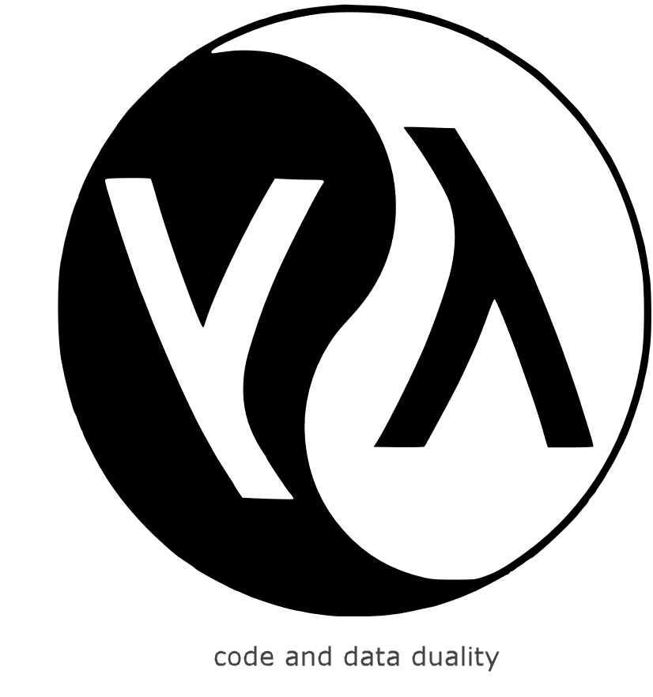

## Homoiconic

ClojureScript is a modern LISP, and LISPs are **homoiconic**.  

You program in a LISP by creating and assembling LISP data structures. The syntax is data literals.
Dwell on that for a moment. You are **_programming in data_**. 
The functions which later transform data, themselves start as data.
Computation involves evaluating data. Macros, running at compile time, take code (which is just data)
and rewrite it to other code (other data). The duality of code and data runs deep. 

So, Clojurists place particular emphasis on the primacy of data. 

They meditate on aphorisms like **_data is the ultimate in late binding_**. They 
exalt inequalities like `data > functions > macros`. (They also 
re-watch Rich Hickey videos a bit too much, and wish that
their hair was darker and more curly.)

I cannot stress enough what a big deal this is. It will seem 
like a syntax curiosity at first but, when the penny drops for 
you on this, it tends to be a profound moment.

So, it will come as no surprise, then, to find that re-frame has a 
data-oriented design. Events are data. Effects are data. DOM is data.
The functions which transform data are registered and looked up via 
data. Interceptors (data) are preferred to middleware (higher 
order functions). Etc.

And re-frame apps are reactive 
which further elevates data because in reactive systems, 
it is the arrival of data which [coordinates the calling of functions](https://www.youtube.com/watch?v=ZgqFlowyfTA&t=80), not the other way around. 

Data - that's the way we roll.

## The Data Loop 

Architecturally, re-frame implements "a perpetual loop".

To build an app, you hang pure functions on certain parts of this loop, 
and re-frame looks after the **conveyance of data** 
around the loop, into and out of the transforming functions you 
provide. The tag line for re-frame is "derived values, flowing".

Remember this diagram from school? The water cycle, right?

Two distinct stages, involving water in different phases, being acted upon
by different forces: gravity working one way, evaporation and convection the other.

To understand re-frame, **imagine data flowing around that loop instead of water**.

re-frame provides the conveyance of the data around the loop - the equivalent
of gravity, evaporation and convection.
You design what's flowing, and then you hang functions on the loop at
various points to compute the data's phase changes.

Sure, right now, you're thinking "lazy sod - make a proper Computer Science-y diagram". But, no.
Joe Armstrong says "don't break the laws of physics" - I'm sure
you've seen the videos - and if he says to do something, you do it
(unless Rich Hickey disagrees, and says to do something else). 

So, this diagram, apart from being a plausible analogy which might help
you to understand re-frame, is **practically proof** it does physics.

<!--  too many jokes for one page 

## On Bourgeois Claims

It isn't easy being a framework creator. We're constantly buffeted by the impressive marketing claims of 
new entrants. These shiny new things are at once "blazingly fast" and "elegantly" reducing something bad,
while also being utterly awesome at ... good things. It is easy to feel insecure about your baby.

Of course, a few months later, you read frustrated tweets calling out the design tradeoffs of these new wonders. 

For a brief period there, I engaged. I insisted that "re-frame puts state into state of the art"
and I felt pretty smug about that.  Don't judge me - I said it was difficult. 

But I'm older and wiser now. These days I only claim only that re-frame involves 
"derived data flowing" and that it provides state management via six dominoes.
-->

## Six Dominoes

Each iteration of the re-frame loop has 6 stages, and because these stages happen one after the other, 
we talk about this process as a six domino cascade.

One domino triggers the next, which triggers the next, boom, boom, boom, until we are 
back at the beginning of the loop, and the dominoes reset to attention 
again, ready for the next iteration of the same cascade.

The six dominoes are:

1. Event dispatch
2. Event handling 
3. Effect handling 
4. Query
5. View
6. DOM

Let's begin by looking at each of them from a great height - maybe **from 60,000 feet**.

## 1st Domino - Event Dispatch

An **_event_** is sent when something happens - the user 
clicks a button, or a websocket receives a new message.

Without the impulse of a triggering `event`, no six domino cascade occurs.
It is only because of `events` that a re-frame app is propelled,
loop iteration after loop iteration, from one state to the next.

**re-frame is event driven.**

## 2nd Domino - Event Handling

In response to an `event`, an application must decide what action to take. 
This is known as **event handling**.

Event handler functions compute how an event should change "the world",
which is to say that they compute the `side effects` of the event.
Or, more accurately, they compute **a declarative description** of the required
`side effects` - represented as data.  

So `event handlers` are just functions which compute data, and that data describes what needs to happen.

Much of the time, an event will only cause `side effects` to 
"application state", but sometimes the outside world must also be affected:
localstore, cookies, databases, emails, logs, etc.

## 3rd Domino - Effect Handling

In this step, the `side effects`, calculated by the previous step, are actioned. 

Data gets turned into action and the world is mutated.

Now, to a functional programmer, `effects` are scary in a 
xenomorph kind of way. Nothing messes with functional purity
quite like the need for side effects. 

On the other hand, `effects` are 
marvelous because they move the app forward. Without them, 
an app stays stuck in one state forever, never achieving anything.

So re-frame embraces the protagonist nature of `effects` - the entire, unruly zoo of them - but
it does so in a controlled and largely hidden way, and in a manner which is debuggable, auditable, mockable and pluggable.

## We're Now At A Pivot Point

Domino 3 just changed the world and, very often, one particular part of it: the **application state**.

re-frame's `application state` is held in one place - think of it like you 
would an in-memory, central database for the app (details soon).

Any changes to `application state` trigger the next part of the cascade 
involving dominoes 4-5-6.

## There's a Formula For It 

The 4-5-6 domino cascade implements the formula made famous by Facebook's ground-breaking React library: `v = f(s)`

A view, `v`, is a function, `f`, of the app state, `s`.

Said another way, there are functions `f` that compute which DOM nodes, `v`,
should be displayed to the user when the application is in a given app state, `s`.

Or, to capture the dynamics we'd say: **over time**, as `s` changes, `f`
will be re-run each time to compute new `v`, forever keeping `v` up to date with the current `s`.

Or, with yet another emphasis: **over time** what is presented to the user changes in response to application state changes. 

In our case, domino 3 changes `s`, the application state,
and, in response, dominoes 4-5-6 are concerned with re-running `f` to compute the new `v` 
shown to the user.

Except, there's no single `f` to run. There are many `f` which 
collectively build the overall `v`. And only a certain part of `s` 
may have changed, meaning only a subset of 
the `f` need rerun, to re-compute a subset of `v`. 

## Domino 4 - Query

Domino 4 is about extracting data from "app state", and providing it 
in the right format for the `ViewFunctions` of domino 5.

Domino 4 is a novel and efficient de-duplicated `Signal Graph` which 
runs query functions on the app state, efficiently computing 
reactive, multi-layered, "materialised views" of it. 

Please relax about any unfamiliar terminology, you'll soon 
see how simple the code is in practice.

## Domino 5 - View

Domino 5 is many **ViewFunctions** (aka Reagent components) which collectively
render the UI of the application. 

Each `ViewFunction` renders part of the whole. These functions compute and return 
data in a format called **hiccup** which represents DOM. 

To render the right DOM, `ViewFunctions` must obtain state using the signal graph of domino 4.
They use a `subscribe` facility which reactively delivers this state. They automatically re-run 
in response to changes in the Signal Graph, keeping the UI up to date. 

So, after the application state changes in domino 3, data flows through the Signal Graph of domino 4, causing 
the `ViewFunctions` to re-render the UI presented to the user.

## Domino 6 - DOM

You don't write Domino 6 - it is handled for you 
by Reagent/React. I mention it here 
for completeness and to fully close the loop.

This is the step in which the hiccup-formatted 
"descriptions of required DOM", returned by the `ViewFunctions` of Domino 5, are actioned. 
The browser DOM nodes are mutated. 

