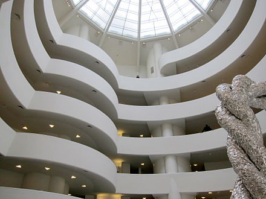
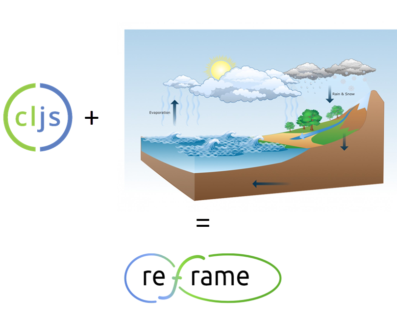

## The re-frame Logo

Created by the mysterious @martinklepsch

Some say he appears on high value stamps in Germany and that he once 
punched a horse to the ground. Others say that he loves recursion so much 
that in his wallet he keeps a photograph of his wallet.

All we know for certain is that he wields [Sketch.app](https://www.sketchapp.com/) like
Bruce Lee wielded nunchucks.

## Genesis Theories

While we wouldn't presume to fathom the cavernous depths of Martin's creativity, some have 
speculated the re-frame logo was created as a bifarious rainbow omage to Frank Lloyd Wright's Guggenheim.

  
Others scoff and insist he smeared the cljs logo across re-frame's official 
architecture diagram to form a flowing poststructuralist rebuttal of the tyrannical 
"OO" adjacency. 

You be the judge. 
Are we better off never knowing?  Does art require an answer?

### Instructions 

Use [Sketch.app](https://www.sketchapp.com/) to update the `re-frame-logo.sketch` file.

Unfortunately the gradients are not exported properly so we can't provide an SVG here for now.
